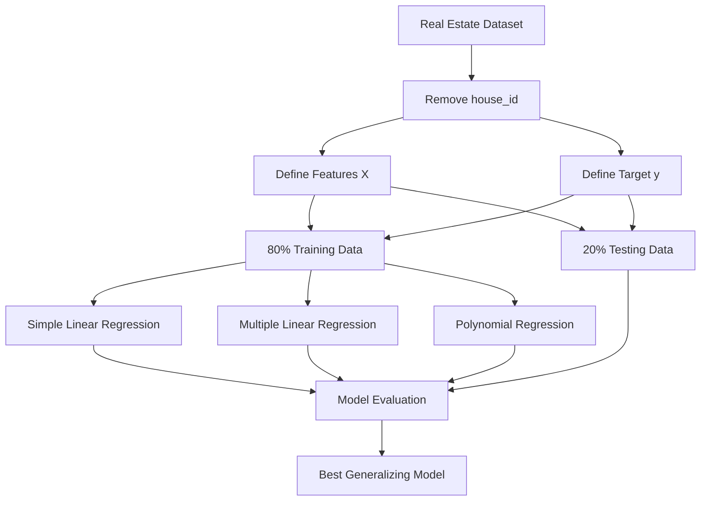
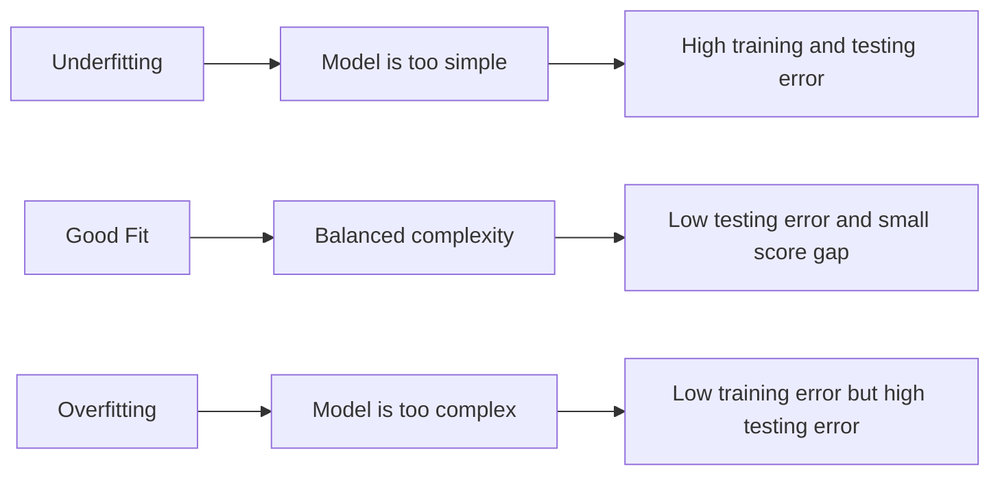
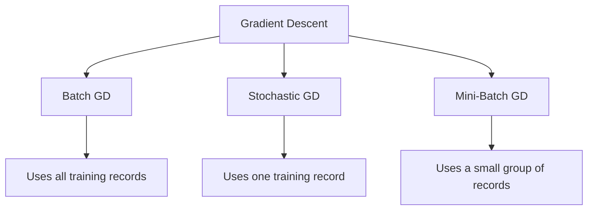

<!-- ===================== BANNER ===================== -->

<div align="center">


<p>
A complete regression-based machine learning project that predicts house prices,
compares multiple regression models, evaluates bias and variance, and implements
Gradient Descent optimization from scratch.
</p>

<!-- ===================== MAIN BADGES ===================== -->

[](https://www.python.org/)
[](https://github.com/DevanshiCodesAI/Predective_Insight_Engine_SupervisedLearning/blob/main/Predictive_Insight_Engine.ipynb)
[](https://scikit-learn.org/)
[](#-models-implemented)

<br>

<!-- ===================== PROJECT BUTTONS ===================== -->

[](https://github.com/DevanshiCodesAI/Predective_Insight_Engine_SupervisedLearning/blob/main/Predictive_Insight_Engine.ipynb)


<br>

[](https://github.com/DevanshiCodesAI/Predective_Insight_Engine_SupervisedLearning/blob/main/Predictive_Insight_Engine_Theory_Notes.pdf)
[](https://docs.google.com/document/d/17A-rlWF0LdG0Er8WcyN76Ng8nsYIEijZxZ3oSc4tedk/edit?tab=t.0)
[](YOUR_GOOGLE_DRIVE_VIDEO_LINK)
[](YOUR_OUTPUT_LINK)

<br>

[Overview](#-project-overview) •
[Dataset](#-dataset) •
[Workflow](#-project-workflow) •
[Models](#-models-implemented) •
[Evaluation](#-model-evaluation) •
[Gradient Descent](#-gradient-descent) •
[Run Project](#-run-the-project)

</div>

---

## 📌 Project Overview

The **Predictive Insight Engine** is a supervised machine learning project developed to predict residential house prices using important property characteristics.

The project represents a real estate analytics use case in which a Junior Data Scientist is required to design, implement, evaluate, and compare multiple regression models.

The prediction is based on features such as:

- House area
- Bedrooms and bathrooms
- Location score
- Age of the property
- Distance from the city
- Lot size
- Garage and pool availability
- Renovation information

The project also evaluates linear regression assumptions, model complexity, overfitting, underfitting, and different Gradient Descent optimization methods.

---

## 🎯 Project Objectives

- Understand supervised learning and regression.
- Explore and prepare the real estate dataset.
- Identify independent and dependent variables.
- Visualize relationships between features and house price.
- Implement Simple Linear Regression.
- Implement Multiple Linear Regression.
- Implement Polynomial Regression.
- Evaluate models using multiple regression metrics.
- Validate linear regression assumptions.
- Implement Gradient Descent algorithms from scratch.
- Compare Batch, Stochastic, and Mini-Batch Gradient Descent.
- Analyze the bias–variance trade-off.
- Select the model that generalizes best.

---

## 🔗 Important Project Links

| Resource | Description | Link |
|---|---|---|
| Jupyter Notebook | Complete Python implementation | [Open Notebook](https://github.com/DevanshiCodesAI/Predective_Insight_Engine_SupervisedLearning/blob/main/Predictive_Insight_Engine.ipynb) |
| Google Colab | Run the notebook online | [Open in Colab](https://colab.research.google.com/github/DevanshiCodesAI/Predective_Insight_Engine_SupervisedLearning/blob/main/Predictive_Insight_Engine.ipynb) |
| Theory PDF | Conceptual questions and answers | [View Theory PDF](YOUR_THEORY_PDF_LINK) |
| Project Task | Original project instructions | [View Task](https://docs.google.com/document/d/17A-rlWF0LdG0Er8WcyN76Ng8nsYIEijZxZ3oSc4tedk/edit?tab=t.0) |
| Dataset | Real estate records in Google Sheets | [View Dataset](https://docs.google.com/spreadsheets/d/1PkMQDotO2G4xUsD8cJ7OFTHStLvU2VE7Ou7_5ktLykM/edit?gid=1756734646#gid=1756734646) |
| Demo Video | Project explanation and demonstration | [Watch Video](YOUR_GOOGLE_DRIVE_VIDEO_LINK) |
| Output | Model results, graphs, and screenshots | [View Output](YOUR_OUTPUT_LINK) |

---

## 🛠️ Libraries and Tools

<div align="center">

[](https://www.python.org/)
[](https://numpy.org/)
[](https://pandas.pydata.org/)
[](https://matplotlib.org/)
[](https://seaborn.pydata.org/)
[](https://scikit-learn.org/)
[](https://jupyter.org/)
[](https://colab.research.google.com/)

</div>

### Purpose of each library

| Library | Purpose |
|---|---|
| `NumPy` | Numerical operations, arrays, and mathematical calculations |
| `Pandas` | Loading, cleaning, and analyzing tabular data |
| `Matplotlib` | Creating regression, residual, and comparison plots |
| `Seaborn` | Statistical visualizations and correlation heatmaps |
| `Scikit-learn` | Data splitting, preprocessing, regression, and evaluation |
| `Jupyter Notebook` | Interactive coding, analysis, and documentation |

---

## 🗂️ Dataset

The dataset contains approximately **4,200 residential property records**.

[](https://docs.google.com/spreadsheets/d/1PkMQDotO2G4xUsD8cJ7OFTHStLvU2VE7Ou7_5ktLykM/edit?gid=1756734646#gid=1756734646)

### Data Dictionary

| Column | Data Type | Description | Role |
|---|---|---|---|
| `house_id` | Integer | Unique house identifier | Excluded |
| `area_sqft` | Integer | House area in square feet | Feature |
| `bedrooms` | Integer | Number of bedrooms | Feature |
| `bathrooms` | Integer | Number of bathrooms | Feature |
| `location_score` | Float | Quality score of the location | Feature |
| `age_years` | Integer | Age of the property | Feature |
| `distance_city_km` | Float | Distance from the city center | Feature |
| `lot_size_sqft` | Integer | Total lot size in square feet | Feature |
| `has_garage` | Binary | Whether the house has a garage | Feature |
| `has_pool` | Binary | Whether the house has a swimming pool | Feature |
| `renovation_year` | Integer | Renovation-related information | Feature |
| `house_price_inr` | Integer | House price in Indian Rupees | **Target** |

### Independent and Dependent Variables

```text
Independent variables (X):
area_sqft, bedrooms, bathrooms, location_score, age_years,
distance_city_km, lot_size_sqft, has_garage, has_pool,
renovation_year

Dependent variable (y):
house_price_inr
```

The `house_id` column is excluded because it is only a unique identifier and does not describe the property.

---

## 🔄 Project Workflow

```mermaid
flowchart LR
    A[Load Dataset] --> B[Inspect Data]
    B --> C[Prepare Features]
    C --> D[Exploratory Analysis]
    D --> E[Train-Test Split]
    E --> F[Train Models]
    F --> G[Generate Predictions]
    G --> H[Evaluate Models]
    H --> I[Bias-Variance Analysis]
    I --> J[Final Conclusion]
```



### Model Training Process



---

## 📖 Theory Overview

### 1. Supervised Learning

Supervised learning is a machine learning approach in which a model learns from labeled examples. Each training record contains input features and a known output.

```text
Input features (X) → Model → Predicted output (y)
```

---

### 2. Regression vs Classification

| Regression | Classification |
|---|---|
| Predicts a continuous number | Predicts a category or class |
| Example: House price | Example: Expensive or affordable |
| Output: ₹4,025,084 | Output: High-price category |

---

### 3. Simple Linear Regression

Simple Linear Regression predicts a target using one independent variable.

```text
Predicted Price = Intercept + Slope × Area
```

Simple form:

```text
y_pred = b0 + b1 × x
```

Where:

- `y_pred` = predicted house price
- `b0` = intercept
- `b1` = slope
- `x` = house area

The slope tells us how much the predicted house price changes when the area increases by one square foot.

---

### 4. Multiple Linear Regression

Multiple Linear Regression uses several property features.

```text
Predicted Price =
Intercept
+ b1 × Area
+ b2 × Bedrooms
+ b3 × Bathrooms
+ b4 × Location Score
+ ...
```

Simple form:

```text
y_pred = b0 + b1x1 + b2x2 + ... + bpxp
```

It can capture more information than Simple Linear Regression because house price depends on several factors.

---

### 5. Polynomial Regression

Polynomial Regression adds powers of a feature to capture curved relationships.

Degree 2:

```text
y_pred = b0 + b1x + b2x²
```

Degree 3:

```text
y_pred = b0 + b1x + b2x² + b3x³
```

A polynomial model may capture nonlinearity, but unnecessary complexity can cause overfitting.

---

### 6. Linear Regression Assumptions

- **Linearity:** Features and target should have an approximately linear relationship.
- **Independence:** Observations should be independent.
- **Homoscedasticity:** Residual variance should remain approximately constant.
- **Normal residuals:** Residuals should be approximately normally distributed.
- **Low multicollinearity:** Features should not be excessively correlated.

---

### 7. Overfitting and Underfitting



- **Underfitting:** The model fails to learn important patterns.
- **Overfitting:** The model learns training noise and performs poorly on unseen data.
- **Good fit:** The model learns useful patterns and generalizes well.

---

## 🤖 Models Implemented

| Model | Input Features | Purpose |
|---|---|---|
| Simple Linear Regression | `area_sqft` | Establish a baseline model |
| Multiple Linear Regression | All relevant features | Capture multiple price drivers |
| Polynomial Regression — Degree 2 | Polynomial area terms | Capture moderate nonlinearity |
| Polynomial Regression — Degree 3 | Polynomial area terms | Examine increased complexity |
| Batch Gradient Descent | Entire training dataset | Stable optimization |
| Stochastic Gradient Descent | One observation per update | Frequent updates |
| Mini-Batch Gradient Descent | Small groups of observations | Balance speed and stability |

---

## 📏 Model Evaluation

The models are evaluated on testing data that was not used for model training.

### Mean Absolute Error

Average absolute difference between actual and predicted prices:

```text
MAE = average(|Actual Price - Predicted Price|)
```

- Lower MAE is better.
- MAE is expressed in INR.
- It represents the average prediction error.

### Mean Squared Error

Average of squared prediction errors:

```text
MSE = average((Actual Price - Predicted Price)²)
```

- Lower MSE is better.
- Large errors receive a stronger penalty.

### Root Mean Squared Error

Square root of MSE:

```text
RMSE = √MSE
```

- Lower RMSE is better.
- RMSE is expressed in the same unit as house price.

### R² Score

Percentage of variation in house price explained by the model:

```text
R² = 1 - (Unexplained Variation / Total Variation)
```

- A higher R² is generally better.
- `R² = 1` means perfect predictions.
- `R² = 0` means the model does not outperform predicting the mean.

### Adjusted R²

R² adjusted for the number of features:

```text
Adjusted R² = 1 - [(1 - R²) × (n - 1) / (n - p - 1)]
```

Where:

- `n` = number of testing records
- `p` = number of features
- `R²` = R² score

Adjusted R² penalizes the model for adding features that do not improve its predictions.

---

## 📊 Model Results

> Update this table using the results generated by the notebook.

| Model | MAE | MSE | RMSE | R² | Adjusted R² |
|---|---:|---:|---:|---:|---:|
| Simple Linear Regression | `66,989,260,021,849.47` | `6,294,593.70` | `8,184,696.70` | `0.5625` | `0.5620` |
| Multiple Linear Regression | `12,592,918,884,127.74` | `2,604,991.41` | `3,548,650.29` | `0.9178` | `0.9168` |
| Polynomial Regression — Degree 2 | `66,962,947,122,198.21` | `6,292,394.56` | `8,183,089.09` | `0.5627` | `0.5616` |
| Polynomial Regression — Degree 3 | `67,344,557,208,661.60` | `6,312,054.88` | `8,206,372.96` | `0.5602` | `0.5586` |

### How to select the best model

The preferred model should have:

- Low MAE
- Low MSE
- Low RMSE
- High testing R²
- High Adjusted R²
- A small difference between training and testing scores

---

## ⚙️ Gradient Descent

Gradient Descent minimizes prediction error by updating the model parameters repeatedly.

### Parameter update

```text
New Weight = Old Weight - Learning Rate × Gradient
```

### Cost function

```text
Cost = average((Actual Value - Predicted Value)²)
```

The goal is to reduce the cost over multiple iterations.

### Gradient Descent Methods



| Method | Records per update | Convergence | Main benefit |
|---|---:|---|---|
| Batch GD | Entire dataset | Smooth | Stable updates |
| Stochastic GD | One record | Noisy | Frequent updates |
| Mini-Batch GD | Small batch | Moderately smooth | Practical balance |

### Expected Behavior

- **Batch Gradient Descent:** Produces a stable and smooth cost curve.
- **Stochastic Gradient Descent:** Produces a noisy cost curve because parameters are updated after every record.
- **Mini-Batch Gradient Descent:** Offers a balance between computational speed and convergence stability.

---

## ⚖️ Bias–Variance Analysis

The train and test R² scores are compared to diagnose model behavior.

| Observation | Diagnosis |
|---|---|
| Low training and low testing score | Underfitting / high bias |
| High training and much lower testing score | Overfitting / high variance |
| High training and testing scores with a small gap | Good generalization |

### Complexity Relationship

```text
Low Complexity                         High Complexity
      |                                      |
High Bias -------- Balanced Model -------- High Variance
Underfitting                              Overfitting
```

The best model is not necessarily the most complex model. It is the model that performs accurately on unseen testing data without a large train–test performance gap.

---

## 💼 Business Interpretation

This project can support a real estate analytics company by:

- Providing quick preliminary house price estimates.
- Identifying important property price drivers.
- Supporting consistent and data-driven valuations.
- Comparing listed prices with predicted market prices.
- Reducing manual effort during initial valuation.
- Helping analysts communicate why a property receives a particular estimate.

The model should be treated as a decision-support system. Final real estate prices can also depend on market conditions, construction quality, legal status, neighborhood demand, and other features not included in the dataset.

---

## 💻 Important Code Snippets

### 1. Import Libraries and Load Data

```python
import time
import numpy as np
import pandas as pd
import matplotlib.pyplot as plt

from sklearn.model_selection import train_test_split
from sklearn.linear_model import LinearRegression
from sklearn.preprocessing import PolynomialFeatures, StandardScaler
from sklearn.metrics import mean_squared_error, mean_absolute_error, r2_score

sheet_url = (
    "https://docs.google.com/spreadsheets/d/"
    "1PkMQDotO2G4xUsD8cJ7OFTHStLvU2VE7Ou7_5ktLykM/"
    "export?format=csv&gid=1756734646"
)

df = pd.read_csv(sheet_url)

target = "house_price_inr"
X = df.drop(columns=["house_id", target])
y = df[target]

X_train, X_test, y_train, y_test = train_test_split(
    X, y, test_size=0.20, random_state=42
)
```

---

### 2. Evaluation Metrics: MSE, MAE, RMSE, R² and Adjusted R²

```python
def evaluate_model(y_true, y_pred, n_features, model_name):
    mse = mean_squared_error(y_true, y_pred)
    mae = mean_absolute_error(y_true, y_pred)
    rmse = np.sqrt(mse)
    r2 = r2_score(y_true, y_pred)

    n = len(y_true)
    adjusted_r2 = 1 - (
        (1 - r2) * (n - 1) / (n - n_features - 1)
    )

    print(f"\n{model_name}")
    print(f"MSE         : {mse:,.2f}")
    print(f"MAE         : ₹{mae:,.2f}")
    print(f"RMSE        : ₹{rmse:,.2f}")
    print(f"R²          : {r2:.4f}")
    print(f"Adjusted R² : {adjusted_r2:.4f}")

    return {
        "Model": model_name,
        "MSE": mse,
        "MAE": mae,
        "RMSE": rmse,
        "R2": r2,
        "Adjusted_R2": adjusted_r2
    }

results = []
```

---

### 3. Simple Linear Regression

```python
X_simple = df[["area_sqft"]]

Xs_train, Xs_test, ys_train, ys_test = train_test_split(
    X_simple, y, test_size=0.20, random_state=42
)

simple_model = LinearRegression()
simple_model.fit(Xs_train, ys_train)

simple_train_pred = simple_model.predict(Xs_train)
simple_test_pred = simple_model.predict(Xs_test)

print(f"Slope     : {simple_model.coef_[0]:,.2f}")
print(f"Intercept : {simple_model.intercept_:,.2f}")

results.append(
    evaluate_model(
        ys_test,
        simple_test_pred,
        1,
        "Simple Linear Regression"
    )
)
```

#### Regression line

```python
order = np.argsort(Xs_test["area_sqft"].values)

plt.figure(figsize=(10, 6))
plt.scatter(Xs_test, ys_test, alpha=0.5, label="Actual")
plt.plot(
    Xs_test.iloc[order],
    simple_test_pred[order],
    color="red",
    linewidth=2,
    label="Regression Line"
)
plt.xlabel("Area (sq.ft)")
plt.ylabel("House Price (INR)")
plt.title("Simple Linear Regression")
plt.legend()
plt.show()
```

---

### 4. Multiple Linear Regression

```python
multiple_model = LinearRegression()
multiple_model.fit(X_train, y_train)

multiple_train_pred = multiple_model.predict(X_train)
multiple_test_pred = multiple_model.predict(X_test)

results.append(
    evaluate_model(
        y_test,
        multiple_test_pred,
        X_train.shape[1],
        "Multiple Linear Regression"
    )
)
```

#### Feature coefficients

```python
coefficients = pd.DataFrame({
    "Feature": X.columns,
    "Coefficient": multiple_model.coef_
}).sort_values("Coefficient", ascending=False)

coefficients
```

---

### 5. Polynomial Regression

```python
polynomial_models = {}

for degree in [2, 3]:
    poly = PolynomialFeatures(
        degree=degree,
        include_bias=False
    )

    X_poly_train = poly.fit_transform(Xs_train)
    X_poly_test = poly.transform(Xs_test)

    polynomial_model = LinearRegression()
    polynomial_model.fit(X_poly_train, ys_train)

    polynomial_train_pred = polynomial_model.predict(X_poly_train)
    polynomial_test_pred = polynomial_model.predict(X_poly_test)

    polynomial_models[degree] = {
        "transformer": poly,
        "model": polynomial_model,
        "train_pred": polynomial_train_pred,
        "test_pred": polynomial_test_pred
    }

    results.append(
        evaluate_model(
            ys_test,
            polynomial_test_pred,
            X_poly_train.shape[1],
            f"Polynomial Regression Degree {degree}"
        )
    )
```

---

### 6. Model Comparison

```python
results_df = pd.DataFrame(results)
results_df.sort_values("Adjusted_R2", ascending=False)
```

```python
results_df.plot(
    x="Model",
    y=["R2", "Adjusted_R2"],
    kind="bar",
    figsize=(12, 6)
)

plt.title("Model Performance Comparison")
plt.ylabel("Score")
plt.xticks(rotation=20)
plt.tight_layout()
plt.show()
```

---

### 7. Bias–Variance Analysis

```python
bias_variance_results = pd.DataFrame({
    "Model": [
        "Simple Linear Regression",
        "Multiple Linear Regression",
        "Polynomial Degree 2",
        "Polynomial Degree 3"
    ],
    "Train_R2": [
        r2_score(ys_train, simple_train_pred),
        r2_score(y_train, multiple_train_pred),
        r2_score(
            ys_train,
            polynomial_models[2]["train_pred"]
        ),
        r2_score(
            ys_train,
            polynomial_models[3]["train_pred"]
        )
    ],
    "Test_R2": [
        r2_score(ys_test, simple_test_pred),
        r2_score(y_test, multiple_test_pred),
        r2_score(
            ys_test,
            polynomial_models[2]["test_pred"]
        ),
        r2_score(
            ys_test,
            polynomial_models[3]["test_pred"]
        )
    ]
})

bias_variance_results["R2_Gap"] = (
    bias_variance_results["Train_R2"]
    - bias_variance_results["Test_R2"]
)

bias_variance_results
```

```python
bias_variance_results.set_index("Model")[
    ["Train_R2", "Test_R2"]
].plot(
    kind="bar",
    figsize=(12, 6)
)

plt.title("Bias–Variance: Train vs Test R²")
plt.ylabel("R² Score")
plt.xticks(rotation=20)
plt.tight_layout()
plt.show()
```

**Interpretation:**

- Low train and test R² → underfitting (high bias).
- High train R² but much lower test R² → overfitting (high variance).
- High test R² with a small train–test gap → good generalization.

---

### 8. Gradient Descent Preparation

```python
X_scaler = StandardScaler()
y_scaler = StandardScaler()

X_gd = X_scaler.fit_transform(X_train)
y_gd = y_scaler.fit_transform(
    y_train.to_numpy().reshape(-1, 1)
).ravel()

# Add intercept column
X_gd = np.c_[np.ones(X_gd.shape[0]), X_gd]
```

---

### 9. Batch Gradient Descent

```python
def batch_gradient_descent(X, y, lr=0.05, epochs=100):
    weights = np.zeros(X.shape[1])
    history = []

    for _ in range(epochs):
        error = X @ weights - y
        gradient = (2 / len(y)) * X.T @ error
        weights -= lr * gradient
        history.append(np.mean(error ** 2))

    return weights, history

start = time.perf_counter()

batch_weights, batch_history = batch_gradient_descent(
    X_gd, y_gd
)

batch_time = time.perf_counter() - start
```

---

### 10. Stochastic Gradient Descent

```python
def stochastic_gradient_descent(
    X, y, lr=0.01, epochs=100, random_state=42
):
    rng = np.random.default_rng(random_state)
    weights = np.zeros(X.shape[1])
    history = []

    for _ in range(epochs):
        for i in rng.permutation(len(y)):
            xi = X[i:i + 1]
            yi = y[i]
            error = (xi @ weights)[0] - yi
            gradient = 2 * xi.ravel() * error
            weights -= lr * gradient

        history.append(np.mean((X @ weights - y) ** 2))

    return weights, history

start = time.perf_counter()

sgd_weights, sgd_history = stochastic_gradient_descent(
    X_gd, y_gd
)

sgd_time = time.perf_counter() - start
```

---

### 11. Mini-Batch Gradient Descent

```python
def mini_batch_gradient_descent(
    X,
    y,
    lr=0.03,
    epochs=100,
    batch_size=32,
    random_state=42
):
    rng = np.random.default_rng(random_state)
    weights = np.zeros(X.shape[1])
    history = []

    for _ in range(epochs):
        indices = rng.permutation(len(y))
        X_shuffled = X[indices]
        y_shuffled = y[indices]

        for start in range(0, len(y), batch_size):
            X_batch = X_shuffled[start:start + batch_size]
            y_batch = y_shuffled[start:start + batch_size]

            error = X_batch @ weights - y_batch
            gradient = (
                2 / len(y_batch)
            ) * X_batch.T @ error

            weights -= lr * gradient

        history.append(np.mean((X @ weights - y) ** 2))

    return weights, history

start = time.perf_counter()

mini_weights, mini_history = mini_batch_gradient_descent(
    X_gd, y_gd
)

mini_time = time.perf_counter() - start
```

---

### 12. Gradient Descent Comparison

```python
plt.figure(figsize=(11, 6))

plt.plot(batch_history, label="Batch GD")
plt.plot(sgd_history, label="Stochastic GD")
plt.plot(mini_history, label="Mini-Batch GD")

plt.xlabel("Epoch")
plt.ylabel("Scaled MSE")
plt.title("Gradient Descent Convergence")
plt.legend()
plt.show()

gd_results = pd.DataFrame({
    "Method": [
        "Batch GD",
        "Stochastic GD",
        "Mini-Batch GD"
    ],
    "Time_Seconds": [
        batch_time,
        sgd_time,
        mini_time
    ],
    "Final_Cost": [
        batch_history[-1],
        sgd_history[-1],
        mini_history[-1]
    ]
})

gd_results
```

**Expected comparison:**

- **Batch GD:** Smooth and stable convergence.
- **Stochastic GD:** Noisier updates.
- **Mini-Batch GD:** Practical balance of stability and efficiency.

## 🚀 Run the Project

### Option 1: Run with Google Colab

No installation is required.

[](https://colab.research.google.com/github/DevanshiCodesAI/Predective_Insight_Engine_SupervisedLearning/blob/main/Predictive_Insight_Engine.ipynb)

1. Click the button above.
2. Sign in with a Google account.
3. Select **Runtime → Run all**.
4. Wait for the analysis and model outputs.

### Option 2: Run Locally

Clone the repository:

```bash
git clone https://github.com/DevanshiCodesAI/Predective_Insight_Engine_SupervisedLearning.git
```

Open the project directory:

```bash
cd Predective_Insight_Engine_SupervisedLearning
```

Install the required libraries:

```bash
pip install numpy pandas matplotlib seaborn scikit-learn jupyter
```

Start Jupyter Notebook:

```bash
jupyter notebook
```

Open:

```text
Predictive_Insight_Engine.ipynb
```

Run all cells from top to bottom.

---

## 📦 Installation Requirements

```txt
numpy
pandas
matplotlib
seaborn
scikit-learn
jupyter
```

Install everything with:

```bash
pip install numpy pandas matplotlib seaborn scikit-learn jupyter
```

---

## 📌 Final Conclusion

This project demonstrates a complete supervised learning workflow for predicting residential house prices.

The final model should be selected only after comparing the actual test-set results. A suitable model should explain a large proportion of house price variation, produce low prediction error, and maintain a small difference between training and testing performance.

The project demonstrates that:

- Simple Linear Regression provides an interpretable baseline.
- Multiple Linear Regression considers several important property attributes.
- Polynomial Regression can capture nonlinear patterns but may overfit.
- Model evaluation should use more than one metric.
- Gradient Descent behavior depends on how much data is used in each update.
- Bias and variance must be balanced to achieve reliable predictions.

---

## 🔮 Future Improvements

- Apply Ridge and Lasso Regression.
- Use cross-validation for model selection.
- Calculate Variance Inflation Factor for multicollinearity.
- Engineer features from renovation information.
- Apply a logarithmic transformation to skewed prices.
- Add Random Forest and Gradient Boosting models.
- Build a Streamlit web application.
- Add model prediction intervals.
- Deploy the selected model as an API.
- Monitor model performance using updated market data.

---

## ⚠️ Project Limitations

- The model learns only from the features available in the dataset.
- Real estate markets may change over time.
- Missing market and neighborhood information can affect predictions.
- Correlation between features does not prove causation.
- Linear models may not capture every complex pricing relationship.
- The model should be validated before being used for real transactions.

---

## 👩‍💻 Author

<div align="center">

### Devanshi

**Data Science and Machine Learning Enthusiast**

[](https://github.com/DevanshiCodesAI)
[](https://github.com/DevanshiCodesAI/Predective_Insight_Engine_SupervisedLearning)

<br>

If you found this project useful, consider giving the repository a ⭐.

</div>

<!-- ===================== FOOTER ===================== -->


